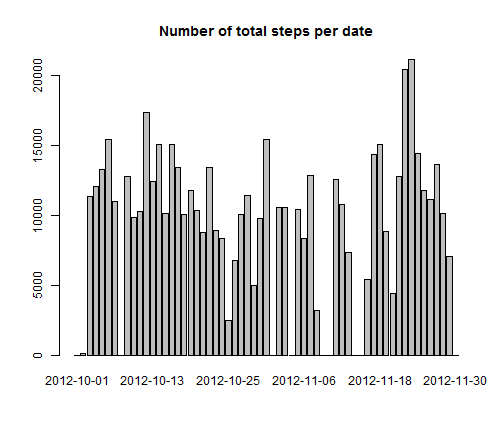
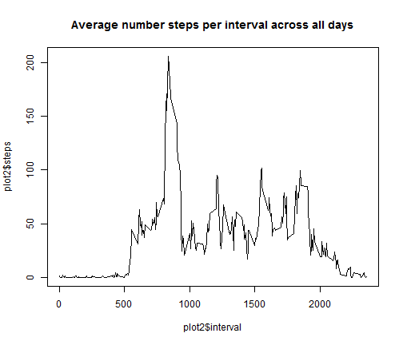
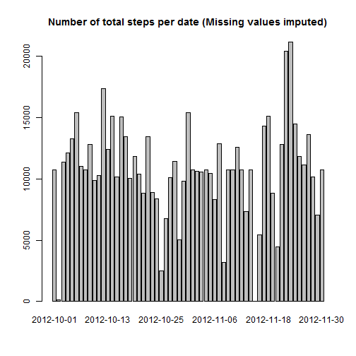
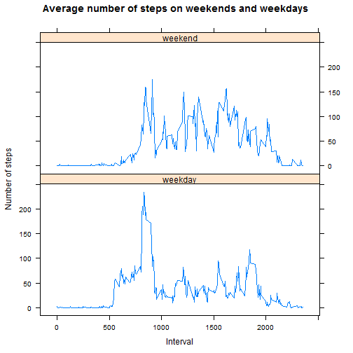

Reproducible Research Peer Assessment 1
========================================================

### Created by Denes Csonka

As a first step, I import and examine the dataset.

### Loading and preprocessing the data


```r
activity<-read.csv("activity.csv")
head(activity)
```

```
##   steps       date interval
## 1    NA 2012-10-01        0
## 2    NA 2012-10-01        5
## 3    NA 2012-10-01       10
## 4    NA 2012-10-01       15
## 5    NA 2012-10-01       20
## 6    NA 2012-10-01       25
```

```r
summary(activity)
```

```
##      steps               date          interval   
##  Min.   :  0.0   2012-10-01:  288   Min.   :   0  
##  1st Qu.:  0.0   2012-10-02:  288   1st Qu.: 589  
##  Median :  0.0   2012-10-03:  288   Median :1178  
##  Mean   : 37.4   2012-10-04:  288   Mean   :1178  
##  3rd Qu.: 12.0   2012-10-05:  288   3rd Qu.:1766  
##  Max.   :806.0   2012-10-06:  288   Max.   :2355  
##  NA's   :2304    (Other)   :15840
```

### Calculating and plotting the steps per day

A histogram of the total number of steps/day is created.
For this, the number of steps was summarized by dates, using the tapply function. 
Missing values are disregarded by setting na.rm=TRUE.
In order to calculate the mean and median over the step variable I had to convert the hist1 which is an array into a dataframe.
Then the histogram was created with the barplot function from the base graphic package.


```r
hist1<-tapply(activity$steps,activity$date,sum, na.rm=TRUE)
barplot(hist1,main=("Number of total steps per date"))
```

 

```r
histdata<-as.data.frame.table(hist1)
colnames(histdata)<-c("date","steps")
meanstep<-mean(histdata$steps)
medianstep<-median(histdata$steps)
```
The mean number of steps per day is: 9354.2295
The median number of steps per day is: 10395

## Calculating and plotting the average daily activity pattern
First, the optimal dataset for the plot was created using the aggregate function and calculating the mean steps over all the intervals.
Then the plot was created using the base graphic package.


```r
plot2<-aggregate(steps ~ interval,data=activity,mean)
plot(plot2$interval, plot2$steps, type="l",main=("Average number steps per interval across all days"))
```

 

```r
maxinter<-plot2[(which.max(plot2$steps)),1]
```
The interval with the maximum number of average steps is: 835

## Imputing missing values
An easy and straightforward strategy was selected to impute missing values. Missing values were replaced with the overall mean.
The new dataset with the imputed values is called the activity2 dataset.

```r
missing<-colSums(is.na(activity))
activity2<-activity
activity2$steps<-ifelse(is.na(activity$steps),mean(activity$steps, na.rm = TRUE),activity$steps)
hist2<-tapply(activity2$steps,activity2$date,sum, na.rm=TRUE)
barplot(hist2,main=("Number of total steps per date (Missing values imputed)"))
```

 

```r
histdata2<-as.data.frame.table(hist2)
colnames(histdata2)<-c("date","steps")
meanstep2<-mean(histdata2$steps)
medianstep2<-median(histdata2$steps)
```
The total number of missing values per column in the activity dataset:
2304, 0, 0
The mean number of steps per day when missing values are imputed: 1.0766 &times; 10<sup>4</sup>
The median number of steps per day when missing values are imputed: 1.0766 &times; 10<sup>4</sup>

It can be seen both from the plot and the above reported values clearly that how much effect can the strategy of imputing values have on the dataset.

## Differences between weekdays and weekends
First I had to set my computer's locale to English for consistency.
The lattice package was loaded for creating the plot.


```r
Sys.setlocale("LC_TIME", "English")
```

```
## [1] "English_United States.1252"
```

```r
require(lattice)
activity$weekday<-weekdays(as.POSIXct(activity$date))
activity$wd<-as.factor(ifelse (activity$weekday=="Sunday" |activity$weekday=="Saturday" ,"weekend","weekday"))
dataplot3<-aggregate(steps ~ interval +wd ,data=activity,mean)
xyplot(steps ~ interval|wd, data=dataplot3,layout=c(1,2) ,type="l",main="Average number of steps on weekends and weekdays",
    xlab="Interval",
    ylab="Number of steps")
```

 

It is interesting to see the difference in the activity of the test subjects on weekends and on weekdays.

